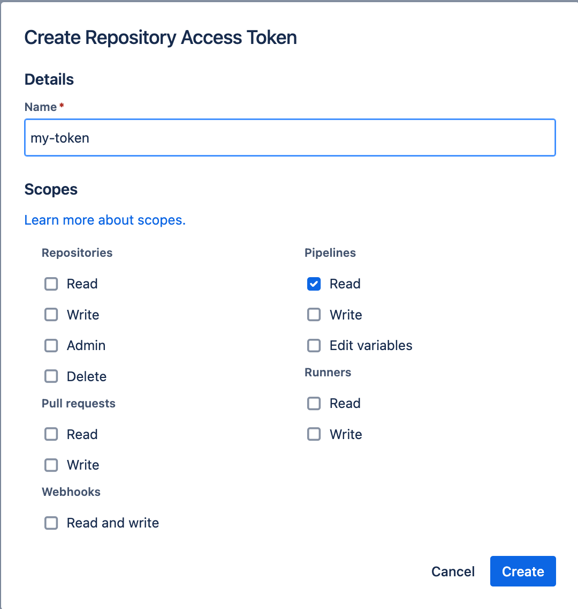

CCTray Proxy
---

### Release

```bash

cargo build --release
```

#### Release to local bin
```bash
mv target/release/cctray-proxy $HOME/local/bin
```

### How to run it?

1. Prepare your configuration file

create token which only have **pipeline readonly** permission.
See 

save the token and repo id in a configuration file locally.

Refer to [example config](./config/example-config.json)

2. Run the following command
```bash
~/Applications/cctray-proxy <path-to-repo-config>
```